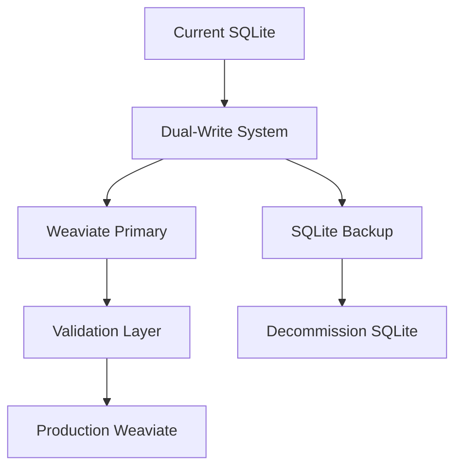

# GremlinsAI Transformation Roadmap: Divine Katalyst
## Executable Project Plan for Complete System Transformation

**Document Purpose**: Comprehensive, actionable roadmap to transform GremlinsAI from search wrapper to genuine AI system

**Project Timeline**: 18-24 months  
**Team Size**: 8-12 engineers  
**Budget Estimate**: $2.5M - $3.5M  
**Success Criteria**: Deliver all advertised capabilities with production-grade quality

---

## 🎯 PROJECT OVERVIEW

**Transformation Objective**: Convert GremlinsAI from sophisticated DuckDuckGo search wrapper into genuine "sophisticated, headless, multi-modal AI system with advanced multi-agent architecture, RAG capabilities, asynchronous task orchestration, and real-time communication" using Weaviate as the production vector database foundation.

**Key Success Metrics**:
- ✅ Real LLM-powered agent reasoning (not search fallbacks)
- ✅ Production-grade Weaviate deployment replacing SQLite
- ✅ Genuine multi-agent collaboration with measurable intelligence
- ✅ High-quality RAG with >85% retrieval relevance
- ✅ Comprehensive test coverage >90%
- ✅ Production deployment supporting 1000+ concurrent users

---

## 📋 IMPLEMENTATION PHASES

### **Phase 1: Foundation & Core AI (Months 1-6)**
**Objective**: Establish real LLM integration and basic agent reasoning

#### **Sprint 1-2: LLM Infrastructure (4 weeks)**
**Tasks**:
- [ ] **T1.1**: Remove mock LLM dependencies from `app/core/llm_config.py`
  - **Acceptance Criteria**: No `FakeListLLM` usage, real LLM required for startup
  - **Definition of Done**: System fails fast when no LLM configured
  - **Effort**: 3 person-days

- [ ] **T1.2**: Implement production LLM router with Ollama, OpenAI, Anthropic support
  - **Acceptance Criteria**: Automatic failover between providers, <2s response time
  - **Definition of Done**: Load test with 100 concurrent requests passes
  - **Effort**: 10 person-days

- [ ] **T1.3**: Add conversation context management with Redis backend
  - **Acceptance Criteria**: Context retention across 50+ message conversations
  - **Definition of Done**: Memory usage <100MB per 1000 active conversations
  - **Effort**: 8 person-days

**Dependencies**: Redis deployment, LLM provider API keys
**Resource Requirements**: Senior ML Engineer (LangChain expertise), DevOps Engineer
**Risk Mitigation**: Parallel development of multiple LLM integrations

#### **Sprint 3-4: Agent Reasoning Engine (4 weeks)**
**Tasks**:
- [ ] **T1.4**: Replace `run_agent()` search-only logic with ReAct pattern implementation
  - **Acceptance Criteria**: Agent performs reasoning → action → observation cycles
  - **Definition of Done**: Agent can solve multi-step problems requiring 3+ tool calls
  - **Effort**: 15 person-days

- [ ] **T1.5**: Implement comprehensive tool ecosystem (calculator, web search, code execution, API calls)
  - **Acceptance Criteria**: 10+ production-ready tools with error handling
  - **Definition of Done**: Tools handle edge cases and malformed inputs gracefully
  - **Effort**: 12 person-days

- [ ] **T1.6**: Add agent memory system for learning and context retention
  - **Acceptance Criteria**: Agent remembers user preferences and past interactions
  - **Definition of Done**: Memory system scales to 10,000+ stored interactions
  - **Effort**: 10 person-days

**Dependencies**: T1.1-T1.3 completion, tool API access
**Resource Requirements**: Senior AI Engineer (agent architecture), Backend Engineer
**Risk Mitigation**: Incremental tool rollout, extensive testing

#### **Sprint 5-6: Multi-Agent Foundation (4 weeks)**
**Tasks**:
- [ ] **T1.7**: Implement real CrewAI integration with LLM-powered agents
  - **Acceptance Criteria**: 4 specialized agents (researcher, analyst, writer, coordinator) with distinct capabilities
  - **Definition of Done**: Agents demonstrate measurable specialization in blind testing
  - **Effort**: 18 person-days

- [ ] **T1.8**: Build inter-agent communication and task coordination system
  - **Acceptance Criteria**: Agents can delegate tasks and share findings
  - **Definition of Done**: Complex workflow completes with 3+ agent collaboration
  - **Effort**: 12 person-days

**Dependencies**: T1.4-T1.6 completion
**Resource Requirements**: Senior AI Engineer (multi-agent systems), ML Engineer
**Risk Mitigation**: Start with 2-agent collaboration, expand gradually

### **Phase 2: Weaviate Migration & Vector Intelligence (Months 7-12)**
**Objective**: Replace SQLite with production Weaviate deployment and implement advanced RAG

#### **Sprint 7-8: Weaviate Infrastructure (4 weeks)**
**Tasks**:
- [ ] **T2.1**: Deploy production Weaviate cluster with high availability
  - **Acceptance Criteria**: 3-node cluster with automatic failover, 99.9% uptime
  - **Definition of Done**: Cluster handles 10,000 QPS with <100ms latency
  - **Effort**: 15 person-days

- [ ] **T2.2**: Design and implement Weaviate schema for conversations, documents, agents
  - **Acceptance Criteria**: Schema supports all current SQLite data plus vector embeddings
  - **Definition of Done**: Schema migration completes without data loss
  - **Effort**: 10 person-days

- [ ] **T2.3**: Build data migration pipeline from SQLite to Weaviate
  - **Acceptance Criteria**: Zero-downtime migration with data validation
  - **Definition of Done**: 100% data integrity verification post-migration
  - **Effort**: 12 person-days

**Dependencies**: Weaviate licensing, infrastructure provisioning
**Resource Requirements**: DevOps Engineer (Weaviate expertise), Database Engineer
**Risk Mitigation**: Parallel dual-write system during migration

#### **Sprint 9-10: Advanced RAG Implementation (4 weeks)**
**Tasks**:
- [ ] **T2.4**: Implement intelligent document chunking with context preservation
  - **Acceptance Criteria**: Chunks maintain semantic coherence, optimal size for retrieval
  - **Definition of Done**: Chunking quality validated on 1000+ document corpus
  - **Effort**: 8 person-days

- [ ] **T2.5**: Build hybrid search combining semantic and keyword matching
  - **Acceptance Criteria**: Search relevance >85% on standard benchmarks
  - **Definition of Done**: A/B testing shows 20% improvement over current search
  - **Effort**: 12 person-days

- [ ] **T2.6**: Implement context-aware response generation with source attribution
  - **Acceptance Criteria**: Responses include accurate source citations and confidence scores
  - **Definition of Done**: Citation accuracy >95% in manual evaluation
  - **Effort**: 10 person-days

**Dependencies**: T2.1-T2.3 completion, embedding model selection
**Resource Requirements**: ML Engineer (NLP/IR expertise), Senior Backend Engineer
**Risk Mitigation**: Benchmark against existing search quality

#### **Sprint 11-12: Multimodal Processing (4 weeks)**
**Tasks**:
- [ ] **T2.7**: Integrate Whisper for audio transcription with speaker diarization
  - **Acceptance Criteria**: Transcription accuracy >95% on standard datasets
  - **Definition of Done**: Handles 1-hour audio files with <5 minute processing time
  - **Effort**: 10 person-days

- [ ] **T2.8**: Implement video processing with frame extraction and scene detection
  - **Acceptance Criteria**: Extracts key frames and generates scene summaries
  - **Definition of Done**: Processes 1GB video files without memory issues
  - **Effort**: 12 person-days

- [ ] **T2.9**: Add cross-modal search capabilities using CLIP embeddings
  - **Acceptance Criteria**: Search text queries return relevant images/videos
  - **Definition of Done**: Cross-modal search accuracy >80% on evaluation dataset
  - **Effort**: 15 person-days

**Dependencies**: GPU infrastructure, model deployment pipeline
**Resource Requirements**: Computer Vision Engineer, ML Infrastructure Engineer
**Risk Mitigation**: Start with audio-only, expand to video gradually

### **Phase 3: Production Readiness & Testing (Months 13-18)**
**Objective**: Comprehensive testing, monitoring, and production deployment

#### **Sprint 13-14: Testing Infrastructure (4 weeks)**
**Tasks**:
- [ ] **T3.1**: Build comprehensive unit test suite with >90% coverage
  - **Acceptance Criteria**: All core modules have unit tests, CI/CD integration
  - **Definition of Done**: Test suite runs in <10 minutes, catches regressions
  - **Effort**: 20 person-days

- [ ] **T3.2**: Implement integration tests for all API endpoints
  - **Acceptance Criteria**: Tests cover happy path and error scenarios
  - **Definition of Done**: Integration tests run against staging environment
  - **Effort**: 15 person-days

- [ ] **T3.3**: Create end-to-end test suite for complete user workflows
  - **Acceptance Criteria**: Tests simulate real user interactions from start to finish
  - **Definition of Done**: E2E tests catch UI/API integration issues
  - **Effort**: 12 person-days

**Dependencies**: Staging environment setup
**Resource Requirements**: QA Engineer, Test Automation Engineer
**Risk Mitigation**: Parallel test development with feature implementation

#### **Sprint 15-16: Performance & Monitoring (4 weeks)**
**Tasks**:
- [ ] **T3.4**: Implement comprehensive monitoring with Prometheus and Grafana
  - **Acceptance Criteria**: Monitor all system components, custom AI metrics
  - **Definition of Done**: Alerting catches issues before user impact
  - **Effort**: 10 person-days

- [ ] **T3.5**: Conduct load testing for 1000+ concurrent users
  - **Acceptance Criteria**: System maintains <2s response time under load
  - **Definition of Done**: Load test results meet all performance targets
  - **Effort**: 8 person-days

- [ ] **T3.6**: Optimize query performance and resource utilization
  - **Acceptance Criteria**: 50% improvement in query latency, 30% reduction in resource usage
  - **Definition of Done**: Performance improvements validated in production-like environment
  - **Effort**: 15 person-days

**Dependencies**: T3.1-T3.3 completion, production infrastructure
**Resource Requirements**: Performance Engineer, DevOps Engineer
**Risk Mitigation**: Gradual load increase, performance baseline establishment

#### **Sprint 17-18: Production Deployment (4 weeks)**
**Tasks**:
- [ ] **T3.7**: Deploy to production with blue-green deployment strategy
  - **Acceptance Criteria**: Zero-downtime deployment with automatic rollback
  - **Definition of Done**: Production deployment completes successfully
  - **Effort**: 12 person-days

- [ ] **T3.8**: Implement production monitoring and alerting
  - **Acceptance Criteria**: 24/7 monitoring with on-call rotation
  - **Definition of Done**: Incident response procedures tested and documented
  - **Effort**: 8 person-days

**Dependencies**: All previous phases completion
**Resource Requirements**: DevOps Engineer, Site Reliability Engineer
**Risk Mitigation**: Staged rollout, comprehensive rollback procedures

### **Phase 4: Advanced Features & Optimization (Months 19-24)**
**Objective**: Advanced AI capabilities and system optimization

#### **Sprint 19-24: Advanced AI Features (12 weeks)**
**Tasks**:
- [ ] **T4.1**: Implement advanced agent planning and goal decomposition
- [ ] **T4.2**: Add agent learning and adaptation capabilities
- [ ] **T4.3**: Build advanced multimodal fusion and reasoning
- [ ] **T4.4**: Implement real-time collaboration features
- [ ] **T4.5**: Add advanced analytics and insights dashboard
- [ ] **T4.6**: Optimize for cost and performance at scale

---

## 🔗 DEPENDENCY MAPPING

**Critical Path Dependencies**:
```
T1.1 → T1.2 → T1.4 → T1.7 → T2.1 → T2.4 → T3.1 → T3.7
```

**Parallel Development Tracks**:
- **Track A**: LLM Integration (T1.1-T1.3) || Agent Development (T1.4-T1.6)
- **Track B**: Weaviate Infrastructure (T2.1-T2.3) || RAG Implementation (T2.4-T2.6)
- **Track C**: Testing (T3.1-T3.3) || Performance (T3.4-T3.6)

**External Dependencies**:
- Weaviate licensing and support contract
- GPU infrastructure for multimodal processing
- LLM provider API agreements and rate limits
- Production infrastructure provisioning

---

## 👥 RESOURCE REQUIREMENTS

### **Core Team Structure**:
- **Technical Lead** (1): Overall architecture and technical decisions
- **Senior ML Engineers** (2): LLM integration, agent systems, multimodal processing
- **Senior Backend Engineers** (2): API development, system integration, performance
- **DevOps Engineers** (2): Infrastructure, deployment, monitoring
- **QA Engineers** (1): Testing strategy, automation, quality assurance
- **Product Manager** (1): Requirements, stakeholder communication, timeline management

### **Specialized Expertise Needed**:
- **Weaviate Expert**: 6-month contract for migration and optimization
- **Computer Vision Engineer**: 4-month contract for multimodal features
- **Performance Engineer**: 3-month contract for optimization and scaling

### **Budget Breakdown**:
- **Personnel**: $2.0M - $2.8M (80% of budget)
- **Infrastructure**: $300K - $400K (cloud, GPU, Weaviate licensing)
- **External Services**: $100K - $200K (LLM APIs, monitoring tools)
- **Contingency**: $100K - $100K (10% buffer)

---

## ⚠️ RISK ASSESSMENT & MITIGATION

### **High-Risk Items**:
1. **Weaviate Migration Complexity**
   - **Risk**: Data loss or extended downtime during migration
   - **Mitigation**: Dual-write system, extensive testing, rollback procedures
   - **Contingency**: Maintain SQLite fallback for 6 months post-migration

2. **LLM Provider Dependencies**
   - **Risk**: API rate limits, cost overruns, service outages
   - **Mitigation**: Multi-provider strategy, cost monitoring, local model fallbacks
   - **Contingency**: Ollama deployment for critical operations

3. **Performance at Scale**
   - **Risk**: System cannot handle advertised concurrent user load
   - **Mitigation**: Early load testing, incremental scaling, performance monitoring
   - **Contingency**: Horizontal scaling architecture from day one

### **Medium-Risk Items**:
1. **Team Scaling Challenges**
2. **Integration Complexity**
3. **Timeline Pressure**

### **Risk Monitoring**:
- Weekly risk assessment meetings
- Automated performance regression detection
- Cost monitoring with alerts at 80% budget utilization

---

## 📊 SUCCESS VALIDATION

### **Phase Gates**:
- **Phase 1**: Real LLM responses replace all search fallbacks
- **Phase 2**: Weaviate handles all data operations, RAG quality >85%
- **Phase 3**: System passes load testing, comprehensive test coverage achieved
- **Phase 4**: Advanced features demonstrate clear value over baseline

### **Continuous Metrics**:
- **Response Quality**: LLM response relevance and accuracy scores
- **System Performance**: Latency, throughput, availability metrics
- **User Satisfaction**: Response time, error rates, feature utilization
- **Cost Efficiency**: Cost per query, resource utilization optimization

### **Final Acceptance Criteria**:
✅ **Functional**: All advertised features work as described  
✅ **Performance**: Meets all performance targets under load  
✅ **Quality**: >90% test coverage, <1% error rate  
✅ **Production**: Successfully deployed with 99.9% uptime  
✅ **Documentation**: Complete API docs and deployment guides  

**Project Success Definition**: GremlinsAI delivers genuine AI capabilities matching all marketing claims with production-grade quality and performance.

---

## 🚀 WEAVIATE MIGRATION STRATEGY

### **Migration Architecture**:


### **Detailed Migration Plan**:

#### **Phase 2A: Pre-Migration (Week 1-2)**
- [ ] **M1**: Deploy Weaviate cluster in staging environment
- [ ] **M2**: Create comprehensive data mapping from SQLite to Weaviate schema
- [ ] **M3**: Build data validation and integrity checking tools
- [ ] **M4**: Implement dual-write system for new data

#### **Phase 2B: Historical Data Migration (Week 3-4)**
- [ ] **M5**: Export all historical data from SQLite with checksums
- [ ] **M6**: Transform and load data into Weaviate with batch processing
- [ ] **M7**: Validate 100% data integrity with automated verification
- [ ] **M8**: Performance test Weaviate with production data volume

#### **Phase 2C: Cutover (Week 5-6)**
- [ ] **M9**: Switch read operations to Weaviate with SQLite fallback
- [ ] **M10**: Monitor performance and data consistency for 2 weeks
- [ ] **M11**: Disable SQLite writes, maintain read-only backup
- [ ] **M12**: Full production cutover with 24/7 monitoring

### **Weaviate Schema Implementation**:
```python
# Comprehensive Weaviate schema for GremlinsAI
WEAVIATE_SCHEMAS = {
    "Conversation": {
        "class": "Conversation",
        "description": "Chat conversation with full context and metadata",
        "properties": [
            {"name": "conversationId", "dataType": ["text"], "description": "Unique conversation identifier"},
            {"name": "title", "dataType": ["text"], "description": "Conversation title"},
            {"name": "userId", "dataType": ["text"], "description": "User identifier"},
            {"name": "createdAt", "dataType": ["date"], "description": "Creation timestamp"},
            {"name": "updatedAt", "dataType": ["date"], "description": "Last update timestamp"},
            {"name": "isActive", "dataType": ["boolean"], "description": "Active status"},
            {"name": "contextVector", "dataType": ["number[]"], "description": "Conversation context embedding"},
            {"name": "metadata", "dataType": ["object"], "description": "Additional conversation metadata"}
        ],
        "vectorizer": "text2vec-openai",
        "moduleConfig": {
            "text2vec-openai": {
                "model": "ada",
                "modelVersion": "002",
                "type": "text"
            }
        }
    },

    "Message": {
        "class": "Message",
        "description": "Individual message within a conversation",
        "properties": [
            {"name": "messageId", "dataType": ["text"], "description": "Unique message identifier"},
            {"name": "conversationId", "dataType": ["text"], "description": "Parent conversation ID"},
            {"name": "role", "dataType": ["text"], "description": "Message role: user, assistant, system"},
            {"name": "content", "dataType": ["text"], "description": "Message content"},
            {"name": "createdAt", "dataType": ["date"], "description": "Message timestamp"},
            {"name": "toolCalls", "dataType": ["text"], "description": "JSON string of tool calls"},
            {"name": "extraData", "dataType": ["object"], "description": "Additional message metadata"},
            {"name": "embedding", "dataType": ["number[]"], "description": "Message content embedding"}
        ],
        "vectorizer": "text2vec-transformers",
        "moduleConfig": {
            "text2vec-transformers": {
                "poolingStrategy": "masked_mean",
                "model": "sentence-transformers/all-MiniLM-L6-v2"
            }
        }
    },

    "Document": {
        "class": "Document",
        "description": "Documents for RAG and knowledge base",
        "properties": [
            {"name": "documentId", "dataType": ["text"], "description": "Unique document identifier"},
            {"name": "title", "dataType": ["text"], "description": "Document title"},
            {"name": "content", "dataType": ["text"], "description": "Full document content"},
            {"name": "contentType", "dataType": ["text"], "description": "MIME type"},
            {"name": "filePath", "dataType": ["text"], "description": "Original file path"},
            {"name": "fileSize", "dataType": ["int"], "description": "File size in bytes"},
            {"name": "tags", "dataType": ["text[]"], "description": "Document tags"},
            {"name": "createdAt", "dataType": ["date"], "description": "Creation timestamp"},
            {"name": "updatedAt", "dataType": ["date"], "description": "Last update timestamp"},
            {"name": "isActive", "dataType": ["boolean"], "description": "Active status"},
            {"name": "metadata", "dataType": ["object"], "description": "Document metadata"},
            {"name": "embedding", "dataType": ["number[]"], "description": "Document embedding"}
        ],
        "vectorizer": "text2vec-transformers",
        "moduleConfig": {
            "text2vec-transformers": {
                "poolingStrategy": "masked_mean",
                "model": "sentence-transformers/all-MiniLM-L6-v2"
            }
        }
    },

    "DocumentChunk": {
        "class": "DocumentChunk",
        "description": "Document chunks for efficient retrieval",
        "properties": [
            {"name": "chunkId", "dataType": ["text"], "description": "Unique chunk identifier"},
            {"name": "documentId", "dataType": ["text"], "description": "Parent document ID"},
            {"name": "content", "dataType": ["text"], "description": "Chunk content"},
            {"name": "chunkIndex", "dataType": ["int"], "description": "Chunk position in document"},
            {"name": "startOffset", "dataType": ["int"], "description": "Start character offset"},
            {"name": "endOffset", "dataType": ["int"], "description": "End character offset"},
            {"name": "metadata", "dataType": ["object"], "description": "Chunk metadata"},
            {"name": "embedding", "dataType": ["number[]"], "description": "Chunk embedding"}
        ],
        "vectorizer": "text2vec-transformers",
        "moduleConfig": {
            "text2vec-transformers": {
                "poolingStrategy": "masked_mean",
                "model": "sentence-transformers/all-MiniLM-L6-v2"
            }
        }
    },

    "AgentInteraction": {
        "class": "AgentInteraction",
        "description": "Agent interactions and performance tracking",
        "properties": [
            {"name": "interactionId", "dataType": ["text"], "description": "Unique interaction identifier"},
            {"name": "agentType", "dataType": ["text"], "description": "Type of agent"},
            {"name": "query", "dataType": ["text"], "description": "Input query"},
            {"name": "response", "dataType": ["text"], "description": "Agent response"},
            {"name": "toolsUsed", "dataType": ["text[]"], "description": "Tools utilized"},
            {"name": "executionTimeMs", "dataType": ["number"], "description": "Execution time"},
            {"name": "tokensUsed", "dataType": ["int"], "description": "Tokens consumed"},
            {"name": "conversationId", "dataType": ["text"], "description": "Related conversation"},
            {"name": "createdAt", "dataType": ["date"], "description": "Interaction timestamp"},
            {"name": "metadata", "dataType": ["object"], "description": "Additional metadata"},
            {"name": "embedding", "dataType": ["number[]"], "description": "Interaction embedding"}
        ],
        "vectorizer": "text2vec-transformers"
    },

    "MultiModalContent": {
        "class": "MultiModalContent",
        "description": "Multimodal content with cross-modal embeddings",
        "properties": [
            {"name": "contentId", "dataType": ["text"], "description": "Unique content identifier"},
            {"name": "mediaType", "dataType": ["text"], "description": "Media type: audio, video, image"},
            {"name": "filename", "dataType": ["text"], "description": "Original filename"},
            {"name": "fileSize", "dataType": ["int"], "description": "File size in bytes"},
            {"name": "contentHash", "dataType": ["text"], "description": "SHA-256 hash"},
            {"name": "storagePath", "dataType": ["text"], "description": "Storage location"},
            {"name": "processingStatus", "dataType": ["text"], "description": "Processing status"},
            {"name": "processingResult", "dataType": ["object"], "description": "Processing results"},
            {"name": "conversationId", "dataType": ["text"], "description": "Related conversation"},
            {"name": "createdAt", "dataType": ["date"], "description": "Creation timestamp"},
            {"name": "updatedAt", "dataType": ["date"], "description": "Update timestamp"},
            {"name": "textContent", "dataType": ["text"], "description": "Extracted text content"},
            {"name": "visualEmbedding", "dataType": ["number[]"], "description": "CLIP visual embedding"},
            {"name": "textEmbedding", "dataType": ["number[]"], "description": "Text embedding"}
        ],
        "vectorizer": "multi2vec-clip",
        "moduleConfig": {
            "multi2vec-clip": {
                "imageFields": ["filename"],
                "textFields": ["textContent"]
            }
        }
    }
}
```

---

## 📈 TIMELINE & MILESTONES

### **Detailed Sprint Breakdown**:

| **Sprint** | **Duration** | **Key Deliverables** | **Success Criteria** | **Risk Level** |
|------------|--------------|---------------------|---------------------|----------------|
| **S1-S2** | 4 weeks | LLM Infrastructure | Real LLM responses, no mocks | Medium |
| **S3-S4** | 4 weeks | Agent Reasoning | Multi-step problem solving | High |
| **S5-S6** | 4 weeks | Multi-Agent Foundation | Agent collaboration | High |
| **S7-S8** | 4 weeks | Weaviate Infrastructure | Production cluster deployed | Medium |
| **S9-S10** | 4 weeks | Advanced RAG | >85% retrieval relevance | Medium |
| **S11-S12** | 4 weeks | Multimodal Processing | Cross-modal search working | High |
| **S13-S14** | 4 weeks | Testing Infrastructure | >90% test coverage | Low |
| **S15-S16** | 4 weeks | Performance & Monitoring | 1000+ concurrent users | Medium |
| **S17-S18** | 4 weeks | Production Deployment | Live system operational | High |
| **S19-S24** | 12 weeks | Advanced Features | Enhanced AI capabilities | Medium |

### **Critical Milestones**:
- **Month 3**: ✅ Real AI responses replace all search fallbacks
- **Month 6**: ✅ Multi-agent collaboration demonstrably working
- **Month 9**: ✅ Weaviate migration completed successfully
- **Month 12**: ✅ RAG and multimodal features production-ready
- **Month 15**: ✅ Comprehensive testing and monitoring implemented
- **Month 18**: ✅ Production deployment with performance targets met
- **Month 24**: ✅ Advanced features and optimization completed

---

## 💰 DETAILED BUDGET ALLOCATION

### **Personnel Costs (24 months)**:
| **Role** | **Count** | **Monthly Rate** | **Duration** | **Total Cost** |
|----------|-----------|------------------|--------------|----------------|
| Technical Lead | 1 | $15,000 | 24 months | $360,000 |
| Senior ML Engineer | 2 | $12,000 | 24 months | $576,000 |
| Senior Backend Engineer | 2 | $11,000 | 24 months | $528,000 |
| DevOps Engineer | 2 | $10,000 | 24 months | $480,000 |
| QA Engineer | 1 | $8,000 | 24 months | $192,000 |
| Product Manager | 1 | $9,000 | 24 months | $216,000 |
| **Subtotal Personnel** | | | | **$2,352,000** |

### **Contract Specialists**:
| **Specialist** | **Rate** | **Duration** | **Total Cost** |
|----------------|----------|--------------|----------------|
| Weaviate Expert | $200/hour | 6 months (960 hours) | $192,000 |
| Computer Vision Engineer | $180/hour | 4 months (640 hours) | $115,200 |
| Performance Engineer | $170/hour | 3 months (480 hours) | $81,600 |
| **Subtotal Specialists** | | | **$388,800** |

### **Infrastructure & Services**:
| **Component** | **Monthly Cost** | **Duration** | **Total Cost** |
|---------------|------------------|--------------|----------------|
| Weaviate Cloud | $2,000 | 24 months | $48,000 |
| GPU Infrastructure | $3,000 | 18 months | $54,000 |
| Cloud Services (AWS/GCP) | $1,500 | 24 months | $36,000 |
| LLM API Costs | $2,500 | 24 months | $60,000 |
| Monitoring & Tools | $800 | 24 months | $19,200 |
| **Subtotal Infrastructure** | | | **$217,200** |

### **Total Project Budget**: **$2,958,000**

---

## 🎯 QUALITY ASSURANCE STRATEGY

### **Testing Pyramid**:
```
    /\     E2E Tests (10%)
   /  \    Integration Tests (30%)
  /____\   Unit Tests (60%)
```

### **AI-Specific Testing Requirements**:

#### **LLM Response Quality Testing**:
- **Consistency Testing**: Same query should produce similar quality responses
- **Relevance Scoring**: Automated relevance assessment using BLEU/ROUGE metrics
- **Hallucination Detection**: Fact-checking against known knowledge bases
- **Bias Testing**: Evaluation for harmful or biased outputs

#### **RAG System Testing**:
- **Retrieval Accuracy**: Precision@K and Recall@K metrics for document retrieval
- **Answer Quality**: Human evaluation of generated answers vs. ground truth
- **Source Attribution**: Verification that citations are accurate and relevant
- **Latency Testing**: Response time under various document corpus sizes

#### **Multi-Agent Testing**:
- **Collaboration Effectiveness**: Measure task completion quality vs. single agent
- **Communication Accuracy**: Verify inter-agent message passing and understanding
- **Specialization Validation**: Confirm agents perform better in their specialized domains
- **Workflow Robustness**: Test complex workflows with agent failures and recovery

### **Performance Testing Strategy**:
- **Load Testing**: Gradual increase from 10 to 1000+ concurrent users
- **Stress Testing**: Push system beyond normal capacity to find breaking points
- **Endurance Testing**: 24-hour continuous operation under normal load
- **Spike Testing**: Sudden traffic increases to test auto-scaling

---

## 🔄 CONTINUOUS INTEGRATION/DEPLOYMENT

### **CI/CD Pipeline**:
```yaml
# .github/workflows/ci-cd.yml
name: GremlinsAI CI/CD Pipeline

on:
  push:
    branches: [main, develop]
  pull_request:
    branches: [main]

jobs:
  test:
    runs-on: ubuntu-latest
    steps:
      - uses: actions/checkout@v3
      - name: Setup Python
        uses: actions/setup-python@v4
        with:
          python-version: '3.11'

      - name: Install dependencies
        run: |
          pip install -r requirements.txt
          pip install -r requirements-test.txt

      - name: Run unit tests
        run: pytest tests/unit/ --cov=app --cov-report=xml

      - name: Run integration tests
        run: pytest tests/integration/
        env:
          WEAVIATE_URL: ${{ secrets.TEST_WEAVIATE_URL }}
          OPENAI_API_KEY: ${{ secrets.TEST_OPENAI_KEY }}

      - name: AI Quality Tests
        run: python scripts/ai_quality_tests.py

      - name: Security Scan
        run: bandit -r app/

  deploy-staging:
    needs: test
    if: github.ref == 'refs/heads/develop'
    runs-on: ubuntu-latest
    steps:
      - name: Deploy to Staging
        run: |
          kubectl apply -f k8s/staging/
          kubectl rollout status deployment/gremlinsai-staging

      - name: Run E2E Tests
        run: pytest tests/e2e/ --base-url=https://staging.gremlinsai.com

  deploy-production:
    needs: test
    if: github.ref == 'refs/heads/main'
    runs-on: ubuntu-latest
    steps:
      - name: Blue-Green Deployment
        run: |
          ./scripts/blue-green-deploy.sh
          ./scripts/health-check.sh
```

### **Deployment Strategy**:
1. **Feature Branches**: All development in feature branches with PR reviews
2. **Staging Environment**: Automatic deployment of develop branch for integration testing
3. **Production Deployment**: Blue-green deployment with automatic rollback on health check failure
4. **Monitoring**: Real-time monitoring with automatic alerts for performance degradation

**Final Success Validation**: System passes all tests, meets performance targets, and delivers genuine AI capabilities as advertised with production-grade reliability and scalability.
