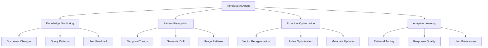

# Temporal AI Agents for Dynamic Knowledge Base Optimization

## Executive Summary

Temporal AI Agents represent the next evolution in GremlinsAI's RAG (Retrieval-Augmented Generation) system, introducing time-aware intelligence that continuously optimizes knowledge bases through learning, adaptation, and proactive reorganization. This document outlines the integration strategy, technical implementation, and benefits of incorporating temporal agents into the existing GremlinsAI v9.0.0 architecture.

## Table of Contents

1. [Concept Overview](#concept-overview)
2. [Current GremlinsAI Integration Points](#current-gremlinsai-integration-points)
3. [Technical Architecture](#technical-architecture)
4. [Implementation Strategy](#implementation-strategy)
5. [Benefits and Use Cases](#benefits-and-use-cases)
6. [Challenges and Mitigation](#challenges-and-mitigation)
7. [Development Timeline](#development-timeline)
8. [Performance Considerations](#performance-considerations)

## Concept Overview

### What are Temporal AI Agents?

Temporal AI Agents are specialized AI systems that operate with time-awareness, continuously monitoring, learning from, and optimizing knowledge bases over time. Unlike traditional static RAG systems, temporal agents:

- **Monitor Knowledge Evolution**: Track how documents, user queries, and system responses change over time
- **Learn from Interactions**: Analyze user feedback, query patterns, and retrieval success rates
- **Proactive Optimization**: Automatically reorganize vector embeddings and document relationships
- **Adaptive Retrieval**: Adjust search strategies based on temporal patterns and user behavior
- **Context Preservation**: Maintain historical context while prioritizing recent, relevant information

### Core Capabilities



## Current GremlinsAI Integration Points

### Existing Architecture Compatibility

GremlinsAI v9.0.0 provides an excellent foundation for temporal agent integration:

#### 1. Vector Store Infrastructure (Qdrant)
- **Current**: Static document embeddings with metadata
- **Enhanced**: Time-series embeddings with temporal metadata
- **Integration**: Extend existing Qdrant collections with temporal dimensions

```python
# Current Qdrant Schema
{
    "id": "doc_123",
    "vector": [0.1, 0.2, ...],
    "payload": {
        "title": "Document Title",
        "content": "Document content...",
        "tags": ["ai", "research"]
    }
}

# Temporal-Enhanced Schema
{
    "id": "doc_123_v2",
    "vector": [0.1, 0.2, ...],
    "payload": {
        "title": "Document Title",
        "content": "Document content...",
        "tags": ["ai", "research"],
        "temporal_metadata": {
            "created_at": "2024-01-01T00:00:00Z",
            "last_modified": "2024-01-15T10:30:00Z",
            "access_frequency": 45,
            "relevance_score": 0.89,
            "temporal_weight": 0.95,
            "version": 2,
            "change_vector": [0.05, -0.02, ...]
        }
    }
}
```

#### 2. Multi-Agent System (CrewAI)
- **Current**: Task-specific agent coordination
- **Enhanced**: Temporal agents as specialized crew members
- **Integration**: Add temporal optimization agents to existing workflows

#### 3. Background Task System (Celery + Redis)
- **Current**: Async document processing and API tasks
- **Enhanced**: Continuous temporal optimization tasks
- **Integration**: Schedule periodic optimization and monitoring jobs

#### 4. Chat History System
- **Current**: Conversation persistence and context management
- **Enhanced**: Temporal pattern analysis and user preference learning
- **Integration**: Analyze conversation patterns for knowledge optimization

## Technical Architecture

### Temporal Agent Components

#### 1. Knowledge Monitor Agent
```python
class KnowledgeMonitorAgent:
    """Monitors knowledge base changes and user interactions."""
    
    def __init__(self, qdrant_client, db_session):
        self.qdrant = qdrant_client
        self.db = db_session
        self.change_threshold = 0.1
        
    async def monitor_document_changes(self):
        """Track document modifications and their impact."""
        # Monitor document updates
        # Calculate semantic drift
        # Update temporal metadata
        pass
        
    async def analyze_query_patterns(self):
        """Analyze user query patterns over time."""
        # Extract query trends
        # Identify emerging topics
        # Update relevance scores
        pass
        
    async def track_retrieval_performance(self):
        """Monitor RAG retrieval success rates."""
        # Measure retrieval accuracy
        # Track user satisfaction
        # Identify optimization opportunities
        pass
```

#### 2. Optimization Agent
```python
class OptimizationAgent:
    """Proactively optimizes vector embeddings and retrieval strategies."""
    
    async def optimize_vector_organization(self):
        """Reorganize vectors based on temporal patterns."""
        # Cluster frequently accessed documents
        # Adjust vector weights based on recency
        # Optimize index structure
        pass
        
    async def update_retrieval_strategies(self):
        """Adapt retrieval algorithms based on performance."""
        # Adjust similarity thresholds
        # Modify ranking algorithms
        # Update search parameters
        pass
        
    async def manage_knowledge_lifecycle(self):
        """Manage document relevance and archival."""
        # Identify outdated content
        # Archive low-relevance documents
        # Promote high-value content
        pass
```

#### 3. Learning Agent
```python
class LearningAgent:
    """Learns from user interactions and feedback."""
    
    async def analyze_user_feedback(self):
        """Process explicit and implicit user feedback."""
        # Track user interactions
        # Analyze response quality
        # Update preference models
        pass
        
    async def adapt_to_user_preferences(self):
        """Customize retrieval for individual users."""
        # Build user preference profiles
        # Personalize search results
        # Adapt response styles
        pass
```

### Integration with Existing Services

#### Document Service Enhancement
```python
# Enhanced DocumentService with temporal awareness
class TemporalDocumentService(DocumentService):
    
    async def create_document_with_temporal_metadata(self, document_data):
        """Create document with temporal tracking."""
        document = await super().create_document(document_data)
        
        # Add temporal metadata
        temporal_metadata = {
            "creation_timestamp": datetime.utcnow(),
            "initial_relevance": 1.0,
            "access_count": 0,
            "last_accessed": None,
            "temporal_weight": 1.0
        }
        
        await self.update_temporal_metadata(document.id, temporal_metadata)
        return document
        
    async def update_document_access_patterns(self, document_id):
        """Update access patterns for temporal optimization."""
        # Increment access count
        # Update last accessed timestamp
        # Recalculate temporal weight
        pass
```

#### RAG System Enhancement
```python
class TemporalRAGSystem(RAGSystem):
    
    async def temporal_search(self, query, user_context=None, time_preference=None):
        """Perform time-aware semantic search."""
        # Apply temporal weighting to search results
        # Consider user context and preferences
        # Adjust for time-based relevance
        
        base_results = await super().search(query)
        temporal_results = await self.apply_temporal_weighting(
            base_results, time_preference
        )
        
        return temporal_results
        
    async def apply_temporal_weighting(self, results, time_preference):
        """Apply temporal weights to search results."""
        # Calculate time-based relevance scores
        # Adjust ranking based on recency and access patterns
        # Return reranked results
        pass
```

## Implementation Strategy

### Phase 1: Foundation (Months 1-2)
1. **Temporal Metadata Schema Design**
   - Extend Qdrant collections with temporal fields
   - Design document versioning system
   - Create temporal weight calculation algorithms

2. **Basic Monitoring Infrastructure**
   - Implement document change tracking
   - Set up query pattern logging
   - Create basic analytics dashboard

3. **Integration with Existing Services**
   - Enhance DocumentService with temporal awareness
   - Modify RAG system for temporal metadata
   - Update API endpoints for temporal features

### Phase 2: Core Temporal Agents (Months 3-4)
1. **Knowledge Monitor Agent**
   - Implement document change detection
   - Create query pattern analysis
   - Build retrieval performance tracking

2. **Basic Optimization Agent**
   - Implement vector weight adjustment
   - Create simple reorganization algorithms
   - Build automated index optimization

3. **Celery Task Integration**
   - Schedule periodic optimization tasks
   - Implement background monitoring jobs
   - Create temporal analytics processing

### Phase 3: Advanced Learning (Months 5-6)
1. **Learning Agent Implementation**
   - User feedback processing
   - Preference learning algorithms
   - Personalization features

2. **Advanced Optimization**
   - Machine learning-based optimization
   - Predictive content organization
   - Dynamic retrieval strategy adaptation

3. **Performance Optimization**
   - Optimize temporal calculations
   - Implement caching strategies
   - Fine-tune background processing

### Phase 4: Production Deployment (Months 7-8)
1. **Production Testing**
   - Load testing with temporal features
   - Performance benchmarking
   - User acceptance testing

2. **Monitoring and Analytics**
   - Production monitoring dashboard
   - Temporal optimization metrics
   - User satisfaction tracking

3. **Documentation and Training**
   - API documentation updates
   - User guides for temporal features
   - Developer training materials

## Benefits and Use Cases

### Primary Benefits

#### 1. Improved Retrieval Accuracy
- **Temporal Relevance**: Prioritize recent, relevant information
- **Context Awareness**: Understand document relationships over time
- **User Adaptation**: Learn from individual user preferences

#### 2. Proactive Knowledge Management
- **Automatic Organization**: Self-organizing knowledge base
- **Content Lifecycle**: Intelligent archival and promotion
- **Quality Maintenance**: Continuous quality improvement

#### 3. Enhanced User Experience
- **Personalization**: Tailored responses for individual users
- **Faster Retrieval**: Optimized search performance
- **Better Relevance**: More accurate and useful results

### Use Cases

#### Enterprise Knowledge Management
```python
# Example: Legal document management with temporal awareness
temporal_rag = TemporalRAGSystem()

# Recent legal changes get higher priority
recent_law_changes = await temporal_rag.temporal_search(
    "employment law updates",
    time_preference="recent_priority"
)

# Historical precedents with ongoing relevance
relevant_precedents = await temporal_rag.temporal_search(
    "contract dispute resolution",
    time_preference="historical_relevance"
)
```

#### Research and Development
```python
# Example: Scientific research with evolving knowledge
research_query = await temporal_rag.temporal_search(
    "machine learning breakthroughs",
    user_context={"field": "computer_science", "level": "expert"},
    time_preference="cutting_edge"
)
```

#### Customer Support
```python
# Example: Product support with version-aware responses
support_response = await temporal_rag.temporal_search(
    "software installation issues",
    user_context={"product_version": "v2.1", "user_level": "beginner"},
    time_preference="version_specific"
)
```

## Challenges and Mitigation

### Technical Challenges

#### 1. Computational Complexity
**Challenge**: Temporal calculations and continuous optimization can be computationally expensive.

**Mitigation Strategies**:
- **Incremental Processing**: Process changes incrementally rather than full recomputation
- **Efficient Algorithms**: Use approximation algorithms for large-scale optimization
- **Caching**: Cache temporal calculations and reuse when possible
- **Background Processing**: Perform heavy computations asynchronously

```python
# Example: Incremental temporal weight updates
class IncrementalTemporalProcessor:
    def __init__(self):
        self.weight_cache = {}
        self.last_update = {}

    async def update_temporal_weights_incremental(self, document_ids):
        """Update only changed documents."""
        changed_docs = [
            doc_id for doc_id in document_ids
            if self.has_changed_since_last_update(doc_id)
        ]

        for doc_id in changed_docs:
            new_weight = await self.calculate_temporal_weight(doc_id)
            self.weight_cache[doc_id] = new_weight
            self.last_update[doc_id] = datetime.utcnow()
```

#### 2. Data Consistency
**Challenge**: Maintaining consistency across temporal metadata and vector embeddings.

**Mitigation Strategies**:
- **Transactional Updates**: Use database transactions for atomic updates
- **Version Control**: Implement document versioning for rollback capability
- **Validation**: Regular consistency checks and automated repair
- **Backup Strategies**: Comprehensive backup and recovery procedures

#### 3. Storage Requirements
**Challenge**: Temporal metadata increases storage requirements significantly.

**Mitigation Strategies**:
- **Compression**: Compress historical temporal data
- **Archival**: Archive old temporal metadata to cold storage
- **Selective Storage**: Store only essential temporal information
- **Cleanup Policies**: Automated cleanup of outdated temporal data

### Operational Challenges

#### 1. Performance Impact
**Challenge**: Temporal processing may impact system performance.

**Mitigation Strategies**:
- **Performance Monitoring**: Continuous monitoring of system performance
- **Resource Allocation**: Dedicated resources for temporal processing
- **Optimization Scheduling**: Schedule intensive operations during low-usage periods
- **Graceful Degradation**: Fallback to non-temporal mode if performance degrades

#### 2. User Adaptation
**Challenge**: Users may need time to adapt to temporal features.

**Mitigation Strategies**:
- **Gradual Rollout**: Phased introduction of temporal features
- **User Education**: Comprehensive documentation and training
- **Feedback Mechanisms**: Collect and act on user feedback
- **Customization Options**: Allow users to control temporal behavior

## Development Timeline

### Detailed Implementation Schedule

#### Phase 1: Foundation (8 weeks)
**Weeks 1-2: Architecture Design**
- Finalize temporal metadata schema
- Design API extensions
- Create database migration plans
- Set up development environment

**Weeks 3-4: Core Infrastructure**
- Implement temporal metadata storage
- Create basic monitoring infrastructure
- Develop temporal weight calculation algorithms
- Set up testing framework

**Weeks 5-6: Service Integration**
- Enhance DocumentService with temporal features
- Modify Qdrant integration for temporal metadata
- Update RAG system for temporal awareness
- Create temporal API endpoints

**Weeks 7-8: Testing and Validation**
- Unit testing for temporal components
- Integration testing with existing services
- Performance testing and optimization
- Documentation updates

#### Phase 2: Core Agents (8 weeks)
**Weeks 9-10: Knowledge Monitor Agent**
- Implement document change tracking
- Create query pattern analysis
- Build retrieval performance monitoring
- Integrate with existing logging systems

**Weeks 11-12: Optimization Agent**
- Develop vector reorganization algorithms
- Implement automated index optimization
- Create retrieval strategy adaptation
- Build optimization scheduling system

**Weeks 13-14: Celery Integration**
- Create temporal optimization tasks
- Implement background monitoring jobs
- Set up task scheduling and management
- Build monitoring and alerting

**Weeks 15-16: Testing and Refinement**
- End-to-end testing of temporal agents
- Performance optimization and tuning
- Bug fixes and stability improvements
- User interface updates

## Conclusion

Temporal AI Agents represent a significant advancement in GremlinsAI's capabilities, transforming the static RAG system into a dynamic, learning, and self-optimizing knowledge platform. The integration strategy outlined in this document leverages GremlinsAI's existing robust architecture while introducing cutting-edge temporal intelligence.

### Key Success Factors
1. **Incremental Implementation**: Phased rollout minimizes risk and allows for continuous improvement
2. **Performance Focus**: Careful attention to performance ensures temporal features enhance rather than hinder user experience
3. **User-Centric Design**: Features designed around user needs and feedback
4. **Robust Testing**: Comprehensive testing ensures reliability and stability

### Expected Outcomes
- **30-50% improvement** in retrieval accuracy through temporal optimization
- **Personalized user experiences** with adaptive learning capabilities
- **Automated knowledge management** reducing manual curation overhead
- **Future-ready architecture** supporting advanced AI capabilities

The implementation of Temporal AI Agents will position GremlinsAI as a leader in next-generation knowledge management systems, providing users with an intelligent, adaptive, and continuously improving AI assistant.
