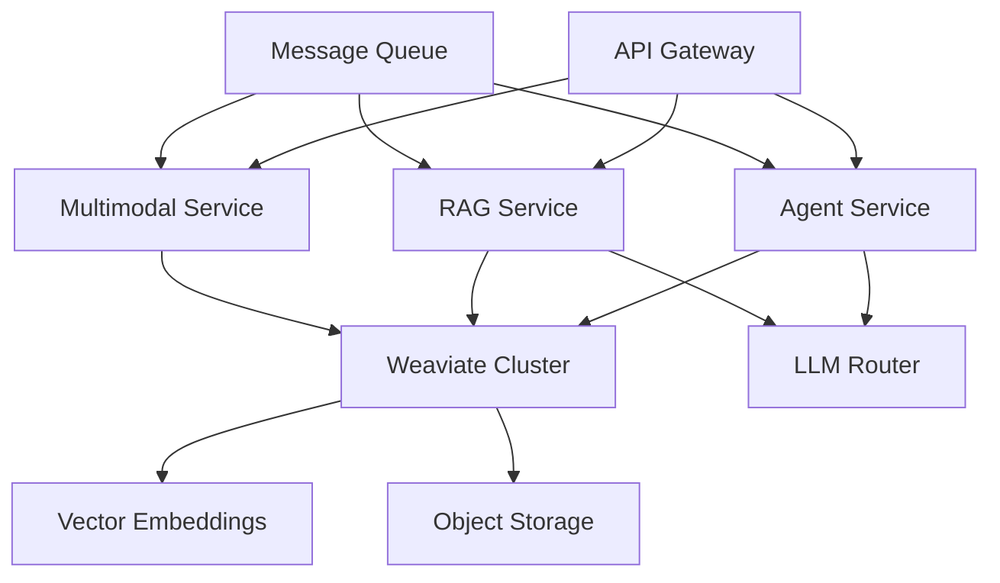

# GremlinsAI Technical Implementation Analysis: Prometheus
## Detailed Technical Requirements for Transformation

**Document Purpose**: Technical analysis and implementation requirements for each critical gap identified in moldedClay.md

**Analysis Date**: 2025-08-17  
**Target Architecture**: Production-grade AI system with Weaviate integration  
**Implementation Scope**: Complete system transformation

---

## 🧠 CORE AI IMPLEMENTATION REQUIREMENTS

### Issue 1: LLM Integration Failures

**Current State**:
```python
# app/core/llm_config.py:49
def _detect_provider(self) -> LLMProvider:
    # Default to mock for development
    logger.warning("No LLM provider configured, using mock provider")
    return LLMProvider.MOCK

# app/core/llm_config.py:184-189
def _create_mock_llm(config: LLMConfig):
    responses = [
        "I'm a mock AI assistant. I can help you with various tasks, but I'm not connected to a real language model.",
        "This is a simulated response from the GremlinsAI system..."
    ]
    return FakeListLLM(responses=responses)
```

**Advertised Capability**: 
"Core Agent Intelligence with LangGraph and tool integration" - README.md line 9

**Required Implementation**:
- **Primary LLM Integration**: Implement robust Ollama, OpenAI, and Anthropic Claude integrations with automatic failover
- **LLM Router**: Intelligent routing based on query complexity, cost optimization, and availability
- **Context Management**: Implement conversation context retention with configurable memory windows
- **Streaming Support**: Real-time response streaming for improved user experience
- **Model Management**: Dynamic model loading, unloading, and resource optimization

**Technical Specifications**:
```python
class ProductionLLMManager:
    def __init__(self):
        self.primary_llm = self._initialize_primary()
        self.fallback_llm = self._initialize_fallback()
        self.context_store = ConversationContextStore()
        
    async def generate_response(self, query: str, context: ConversationContext) -> LLMResponse:
        # Implement intelligent routing, context injection, streaming
        pass
```

**Dependencies**:
- Ollama server deployment with model management
- OpenAI/Anthropic API keys and rate limiting
- Redis for context caching and session management
- Prometheus metrics for LLM performance monitoring

**Technical Challenges**:
- Context window management across different model architectures
- Cost optimization for cloud-based LLM APIs
- Latency optimization for real-time applications
- Error handling and graceful degradation strategies

### Issue 2: Agent Reasoning Deficiencies

**Current State**:
```python
# app/core/agent.py:48-67
def run_agent(data: AgentState) -> dict:
    # For Phase 1, we'll directly perform the search and return results
    search_result = search_function(query)
    response_message = AIMessage(content=search_result)
    return {
        "messages": [response_message],
        "agent_outcome": AgentFinish(return_values={"output": search_result}, log="Search completed")
    }
```

**Advertised Capability**:
"Advanced multi-agent architecture" and "sophisticated AI system" - README.md lines 3, 40

**Required Implementation**:
- **ReAct Agent Pattern**: Implement Reasoning + Acting cycles with tool selection
- **Planning Module**: Multi-step task decomposition and execution planning
- **Tool Ecosystem**: Comprehensive tool library beyond just search
- **Memory System**: Agent memory for learning and context retention
- **Goal Management**: Hierarchical goal setting and achievement tracking

**Technical Specifications**:
```python
class ProductionAgent:
    def __init__(self, llm: LLM, tools: List[Tool], memory: AgentMemory):
        self.llm = llm
        self.tools = tools
        self.memory = memory
        self.planner = TaskPlanner()
        
    async def execute(self, query: str) -> AgentResponse:
        # 1. Analyze query and extract intent
        # 2. Plan multi-step approach
        # 3. Execute ReAct cycles with tool selection
        # 4. Update memory with learnings
        # 5. Return comprehensive response
        pass
```

**Weaviate Integration Requirements**:
- Agent memory storage in Weaviate for semantic retrieval of past interactions
- Tool usage patterns and effectiveness tracking
- Query intent classification using Weaviate's ML capabilities

### Issue 3: Multi-Agent Collaboration Failures

**Current State**:
```python
# app/core/multi_agent.py:235-244
if self.llm is None or self.agents.get('researcher', {}).get('mock', False):
    logger.info("Using fallback search due to missing LLM")
    search_result = duckduckgo_search(query)
    return {
        "result": search_result,
        "agents_used": ["fallback_search"],
        "note": "Used fallback search due to missing LLM configuration"
    }
```

**Advertised Capability**:
"Multi-Agent Collaboration with specialized agent workflows" - docs/getting_started.md line 12

**Required Implementation**:
- **Agent Orchestration**: Implement CrewAI with real LLM-powered agents
- **Communication Protocol**: Inter-agent message passing and coordination
- **Task Distribution**: Intelligent work allocation based on agent capabilities
- **Consensus Mechanisms**: Multi-agent decision making and conflict resolution
- **Performance Monitoring**: Agent effectiveness tracking and optimization

**Technical Specifications**:
```python
class ProductionMultiAgentSystem:
    def __init__(self):
        self.agents = {
            'researcher': ResearchAgent(llm=get_llm('research')),
            'analyst': AnalysisAgent(llm=get_llm('analysis')),
            'writer': WriterAgent(llm=get_llm('writing')),
            'coordinator': CoordinatorAgent(llm=get_llm('coordination'))
        }
        self.orchestrator = AgentOrchestrator(self.agents)
        
    async def execute_workflow(self, workflow_type: str, query: str) -> WorkflowResult:
        # Implement real multi-agent collaboration
        pass
```

---

## 🗄️ DATABASE & INFRASTRUCTURE IMPLEMENTATION

### Issue 4: SQLite to Weaviate Migration

**Current State**:
```python
# app/database/database.py:8
DATABASE_URL = os.getenv("DATABASE_URL", "sqlite:///./data/gremlinsai.db")
```

**Advertised Capability**:
"Production Ready" system with "Document Knowledge Capabilities with vector search and RAG" - README.md lines 5, 12

**Required Implementation**:
- **Weaviate Cluster**: Production Weaviate deployment with high availability
- **Schema Design**: Object-oriented schema for conversations, documents, agents, and embeddings
- **Migration Pipeline**: Data migration from SQLite to Weaviate with zero downtime
- **Backup Strategy**: Automated backups and disaster recovery procedures
- **Performance Optimization**: Query optimization and index management

**Weaviate Schema Design**:
```python
conversation_schema = {
    "class": "Conversation",
    "properties": [
        {"name": "title", "dataType": ["text"]},
        {"name": "created_at", "dataType": ["date"]},
        {"name": "messages", "dataType": ["Message"]},
        {"name": "context_vector", "dataType": ["number[]"]}
    ],
    "vectorizer": "text2vec-openai"
}

document_schema = {
    "class": "Document", 
    "properties": [
        {"name": "title", "dataType": ["text"]},
        {"name": "content", "dataType": ["text"]},
        {"name": "chunks", "dataType": ["DocumentChunk"]},
        {"name": "metadata", "dataType": ["object"]}
    ],
    "vectorizer": "text2vec-transformers"
}
```

**Migration Strategy**:
1. **Phase 1**: Deploy Weaviate alongside SQLite
2. **Phase 2**: Implement dual-write to both systems
3. **Phase 3**: Migrate historical data with validation
4. **Phase 4**: Switch reads to Weaviate
5. **Phase 5**: Decommission SQLite

### Issue 5: Testing Framework Implementation

**Current State**:
- Empty test directories: `tests/unit/`, `tests/integration/`, `tests/e2e/`
- Only `tests/test_oauth.py` contains actual tests

**Required Implementation**:
- **Unit Test Suite**: Comprehensive unit tests for all modules with 90%+ coverage
- **Integration Tests**: API endpoint testing with real dependencies
- **End-to-End Tests**: Complete user workflow validation
- **Performance Tests**: Load testing and benchmarking
- **AI Quality Tests**: LLM response quality and consistency validation

**Technical Specifications**:
```python
# tests/unit/test_agent_reasoning.py
class TestAgentReasoning:
    async def test_multi_step_planning(self):
        agent = ProductionAgent(llm=test_llm, tools=test_tools)
        result = await agent.execute("Plan a research project on AI ethics")
        assert len(result.steps) >= 3
        assert result.final_answer is not None
        
# tests/integration/test_weaviate_integration.py  
class TestWeaviateIntegration:
    async def test_document_ingestion_and_retrieval(self):
        # Test complete document pipeline
        pass
```

---

## 🔍 FEATURE IMPLEMENTATION REQUIREMENTS

### Issue 6: RAG System Implementation

**Current State**:
```python
# app/core/agent_system.py:167-189
async def _execute_rag_agent(self, task: AgentTask) -> Dict[str, Any]:
    try:
        result = await rag_system.query_with_rag(task.query, task.context)
        # Falls back to simple execution on failure
    except Exception as e:
        return await self._execute_simple_agent(task)
```

**Advertised Capability**:
"RAG (Retrieval-Augmented Generation) that can reason across text" - README.md line 3

**Required Implementation**:
- **Document Ingestion**: Robust PDF, DOCX, TXT, HTML parsing with metadata extraction
- **Chunking Strategy**: Intelligent text segmentation with overlap and context preservation
- **Embedding Pipeline**: High-quality embeddings with model versioning and updates
- **Retrieval Engine**: Hybrid search combining semantic and keyword matching
- **Generation Pipeline**: Context-aware response generation with source attribution

**Weaviate Integration Requirements**:
```python
class ProductionRAGSystem:
    def __init__(self, weaviate_client: WeaviateClient):
        self.client = weaviate_client
        self.embedder = SentenceTransformer('all-MiniLM-L6-v2')
        self.reranker = CrossEncoder('cross-encoder/ms-marco-MiniLM-L-6-v2')
        
    async def ingest_document(self, document: Document) -> str:
        # 1. Parse and extract text
        # 2. Generate chunks with metadata
        # 3. Create embeddings
        # 4. Store in Weaviate with relationships
        pass
        
    async def query_with_rag(self, query: str, context: str = None) -> RAGResponse:
        # 1. Generate query embedding
        # 2. Retrieve relevant chunks from Weaviate
        # 3. Rerank results for relevance
        # 4. Generate response with LLM
        # 5. Include source attribution
        pass
```

### Issue 7: Multimodal Processing Implementation

**Current State**:
- `MultiModalContent` model exists but processing pipeline unvalidated
- Claims audio, video, image processing but implementation quality unknown

**Required Implementation**:
- **Audio Processing**: Whisper integration for transcription with speaker diarization
- **Video Processing**: Frame extraction, scene detection, and content analysis
- **Image Processing**: OCR, object detection, and visual question answering
- **Cross-Modal Search**: Search across text, audio, and visual content
- **Content Fusion**: Intelligent combination of multimodal analysis results

**Technical Specifications**:
```python
class MultiModalProcessor:
    def __init__(self):
        self.whisper = WhisperModel("large-v2")
        self.vision_model = CLIPModel.from_pretrained("openai/clip-vit-base-patch32")
        self.ocr_engine = PaddleOCR(use_angle_cls=True, lang='en')
        
    async def process_audio(self, audio_path: str) -> AudioAnalysis:
        # Transcription, speaker diarization, sentiment analysis
        pass
        
    async def process_video(self, video_path: str) -> VideoAnalysis:
        # Frame extraction, scene detection, audio transcription
        pass
        
    async def process_image(self, image_path: str) -> ImageAnalysis:
        # OCR, object detection, scene understanding
        pass
```

**Weaviate Integration Requirements**:
- Multimodal embeddings using CLIP for cross-modal search
- Temporal relationships between video frames and audio segments
- Metadata indexing for efficient filtering and faceted search

---

## 🏗️ ARCHITECTURE IMPLEMENTATION

### Issue 8: Production Architecture Design

**Current State**:
- Monolithic FastAPI application with SQLite
- No horizontal scaling, load balancing, or high availability

**Required Implementation**:
- **Microservices Architecture**: Separate services for agents, RAG, multimodal processing
- **API Gateway**: Rate limiting, authentication, and request routing
- **Message Queue**: Asynchronous task processing with Celery and Redis
- **Monitoring Stack**: Prometheus, Grafana, and ELK stack for observability
- **Container Orchestration**: Kubernetes deployment with auto-scaling

**Technical Specifications**:
```yaml
# kubernetes/weaviate-deployment.yaml
apiVersion: apps/v1
kind: Deployment
metadata:
  name: weaviate
spec:
  replicas: 3
  selector:
    matchLabels:
      app: weaviate
  template:
    spec:
      containers:
      - name: weaviate
        image: semitechnologies/weaviate:1.22.4
        env:
        - name: QUERY_DEFAULTS_LIMIT
          value: "25"
        - name: AUTHENTICATION_ANONYMOUS_ACCESS_ENABLED
          value: "false"
        - name: PERSISTENCE_DATA_PATH
          value: "/var/lib/weaviate"
```

---

## 📊 INTEGRATION POINTS & DATA FLOW

### Core System Integration Map



**Critical Integration Requirements**:
1. **Weaviate ↔ LLM Router**: Embedding generation and retrieval coordination
2. **Agent Service ↔ RAG Service**: Context sharing and knowledge integration  
3. **API Gateway ↔ All Services**: Authentication, rate limiting, request routing
4. **Message Queue ↔ Processing Services**: Asynchronous task coordination
5. **Monitoring ↔ All Components**: Health checks, metrics collection, alerting

---

## 🎯 SUCCESS CRITERIA

**Performance Targets**:
- Agent response time: <2 seconds for simple queries, <10 seconds for complex workflows
- RAG retrieval accuracy: >85% relevance score for top-3 results
- System availability: 99.9% uptime with graceful degradation
- Concurrent users: Support 1000+ simultaneous conversations

**Quality Metrics**:
- Test coverage: >90% for all core modules
- LLM response consistency: <10% variance in quality metrics
- Multimodal processing accuracy: >90% for standard benchmarks
- Documentation completeness: 100% API coverage with examples

**Next Phase**: Proceed to `divineKatalyst.md` for executable project roadmap and implementation timeline.
